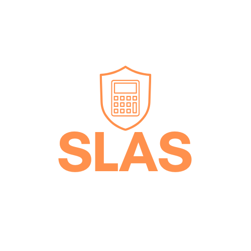

<div align="center">
  

  # SLAS - Sistema de Liquidación de Aportes a Seguridad Social
</div>

## 📋 Descripción

API REST para calcular aportes a seguridad social de trabajadores independientes en Colombia (contrato de prestación de servicios).

**Versión actual:** 1.1.0 (en desarrollo activo)

> **Normativa vigente:** Actualizado con la normativa **2026** — SMMLV $1,750,905 según Decreto 1469 del 29 de diciembre de 2025.

## 🚀 Características v1.0

- ✅ Cálculo de IBC (Ingreso Base de Cotización) con límites legales
- ✅ Aportes obligatorios: Salud (12.5%), Pensión (16%)
- ✅ Fondo de Solidaridad Pensional (FSP) según tabla progresiva
- ✅ Aportes voluntarios: ARL (5 niveles de riesgo) y CCF (0.6% o 2%)
- ✅ Validaciones de datos y consistencia
- ✅ Redondeo de valores monetarios
- ✅ Documentación con Swagger/OpenAPI

## 🛠️ Tecnologías

- Java 21
- Spring Boot 3.5.8
- Maven
- SpringDoc OpenAPI (Swagger)

## 📦 Instalación

### Requisitos previos

Antes de instalar, asegúrate de tener:

- **Java 21** o superior ([Descargar](https://adoptium.net/))
- **Maven 3.6+** ([Descargar](https://maven.apache.org/download.cgi))
- **Git** ([Descargar](https://git-scm.com/downloads))

Verifica las instalaciones:
```bash
java -version   # Debe mostrar Java 21+
mvn -version    # Debe mostrar Maven 3.6+
git --version   # Debe mostrar Git instalado
```

### Pasos de instalación

1. **Clonar el repositorio:**
```bash
git clone https://github.com/luistriana032006/slas-sistema-de-liquidacion-de-aportes.git
cd slas-sistema-de-liquidacion-de-aportes
```

2. **Compilar el proyecto:**
```bash
mvn clean install
```

3. **Ejecutar la aplicación:**
```bash
mvn spring-boot:run
```

4. **Verificar que está funcionando:**

La aplicación se ejecutará en `http://localhost:8080`

Abre tu navegador y accede a:
- **Swagger UI:** http://localhost:8080/swagger-ui.html
- **Health Check:** http://localhost:8080/actuator/health (si está habilitado)

### Ejecución con JAR

Alternativamente, puedes generar un JAR ejecutable:

```bash
# Generar JAR
mvn clean package

# Ejecutar JAR
java -jar target/slas-sistema-de-liquidacion-de-aportes-0.0.1-SNAPSHOT.jar
```

## 📚 Documentación API

Una vez ejecutado, accede a:
- **Swagger UI:** http://localhost:8080/swagger-ui.html
- **OpenAPI JSON:** http://localhost:8080/api-docs

## 🧪 Ejemplo de uso
```bash
POST http://localhost:8080/api/slas/cotizacion
Content-Type: application/json

{
  "ingresosMensual": 8000000,
  "aporteARL": true,
  "nivelRiesgo": "NIVEL_III",
  "aportaCCF": true,
  "porcentajeCCF": 2.0
}
```

**Respuesta:**
```json
{
  "ibc": 3200000.0,
  "salud": 400000.0,
  "pension": 512000.0,
  "fsp": 0.0,
  "arl": 77952.0,
  "ccf": 64000.0,
  "total": 1053952.0
}
```

## 🔮 Roadmap

### v1.1 (Próxima versión)
- [ ] Tests unitarios y de integración
- [ ] GlobalExceptionHandler mejorado
- [ ] Logging estructurado
- [ ] Documentación Swagger personalizada

### v2.0 (Futuro)
- [ ] Soporte para empleados en nómina
- [ ] Historial de cálculos
- [ ] Exportar resultados (PDF/Excel)
- [ ] API de consulta de normativa vigente

## 👨‍💻 Autor

**Luis Miguel Triana Rueda**
- GitHub: [@tuusuario](https://github.com/luistriana032006)
- LinkedIn: [tu-linkedin](https://www.linkedin.com/in/luis-triana-2917202a2/)
- Email: luistriana617@gmail.com

## 📄 Licencia

MIT License

---

**Nota:** Este proyecto fue desarrollado como parte de mi portafolio profesional para demostrar conocimientos en desarrollo backend con Spring Boot y lógica de negocio compleja.
```
---
